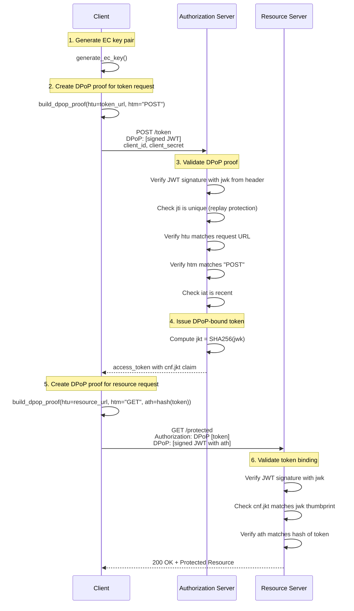
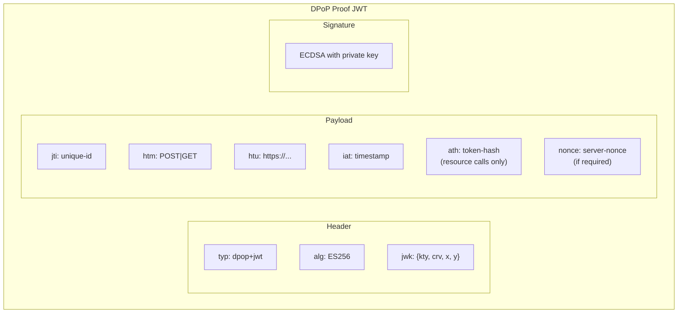
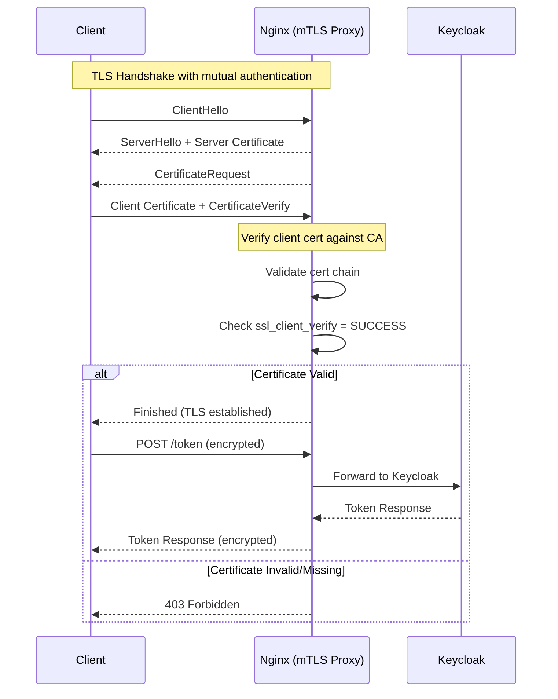
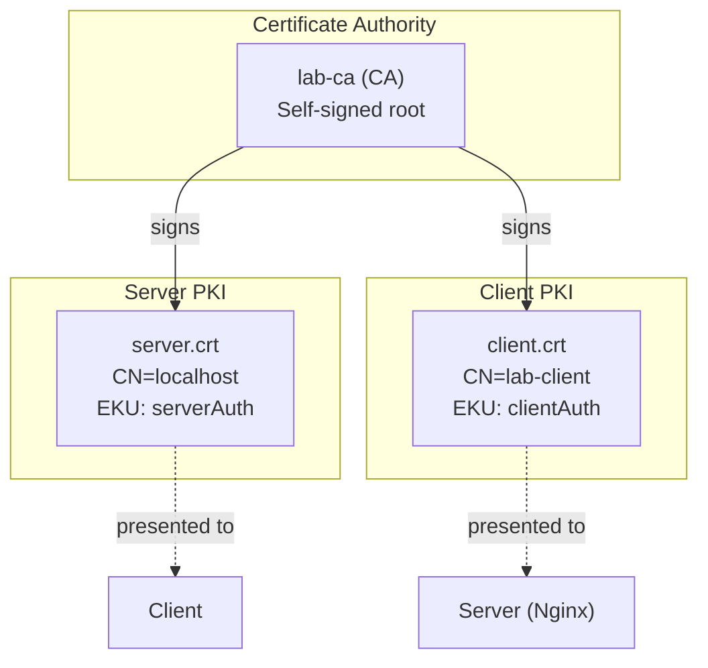
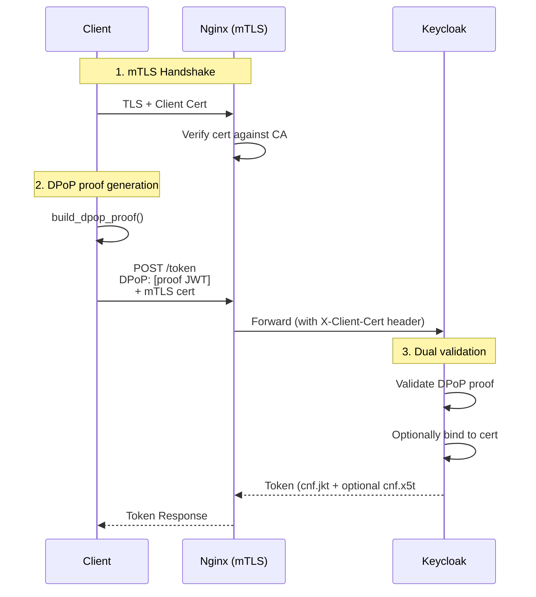

# DPoP & mTLS Flow Diagrams

This document provides visual diagrams explaining how DPoP and mTLS work.

---

## DPoP Token Request Flow

---

## DPoP Proof JWT Structure

---

## mTLS Authentication Flow

---

## PKI Certificate Trust Chain

---

## Combined DPoP + mTLS Flow

---

## Security Comparison

| Feature                | Bearer Token | DPoP | mTLS | DPoP + mTLS |
| ---------------------- | ------------ | ---- | ---- | ----------- |
| Token theft protection | ❌           | ✅   | ✅   | ✅✅        |
| Per-request proof      | ❌           | ✅   | ❌   | ✅          |
| Channel binding        | ❌           | ❌   | ✅   | ✅          |
| Public client support  | ✅           | ✅   | ⚠️   | ⚠️          |
| No cert infrastructure | ✅           | ✅   | ❌   | ❌          |
| Replay protection      | ❌           | ✅   | ✅   | ✅✅        |
