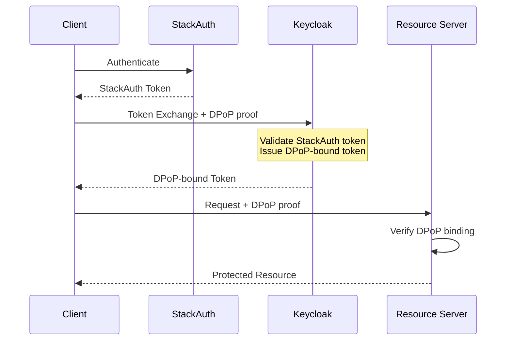

# StackAuth Compatibility Analysis: DPoP & mTLS

## Summary

**StackAuth does NOT natively support DPoP or mTLS token binding.**

Based on research of StackAuth's documentation and capabilities, the platform focuses on:

- OAuth provider integration (Google, GitHub, etc.)
- Password and magic link authentication
- User management and RBAC
- Multi-tenancy

There is no evidence of support for:

- RFC 9449 DPoP (Demonstrating Proof-of-Possession)
- RFC 8705 mTLS (Mutual-TLS Client Authentication and Certificate-Bound Access Tokens)

---

## Compatibility Options

### Option 1: Direct StackAuth (No DPoP/mTLS)

**Use when:** Security requirements allow standard Bearer tokens.

```
Client → StackAuth → Bearer Token → Resource Server
```

- ✅ Simple integration
- ❌ No sender-constrained tokens
- ❌ Token theft risk

---

### Option 2: Keycloak as Token Exchange Broker

**Use when:** You need DPoP/mTLS but consumers already use StackAuth.



**Implementation:**

1. Configure Keycloak as an Identity Broker
2. Trust StackAuth as an external IdP
3. Use Token Exchange (RFC 8693) to swap tokens
4. Enable DPoP in Keycloak for issued tokens

**Keycloak Configuration:**

```json
{
  "realm": "your-realm",
  "identityProviders": [
    {
      "alias": "stackauth",
      "providerId": "oidc",
      "config": {
        "authorizationUrl": "https://your-app.stack-auth.com/authorize",
        "tokenUrl": "https://your-app.stack-auth.com/token",
        "clientId": "keycloak-client",
        "clientSecret": "..."
      }
    }
  ]
}
```

---

### Option 3: API Gateway mTLS Enforcement

**Use when:** You need mTLS at transport layer but can't modify StackAuth tokens.

```
Client ──mTLS──→ API Gateway ──Bearer──→ StackAuth
                     │
                     └──mTLS──→ Resource Server
```

**Architecture:**

- API Gateway (Kong, Ambassador, Nginx) terminates mTLS
- Gateway validates client certificates
- Downstream uses standard Bearer tokens
- Provides transport-level security, not token binding

**⚠️ Limitation:** This is weaker than true mTLS token binding (RFC 8705) because:

- The token itself is not bound to the certificate
- If the token is stolen, it can be used from any connection
- Only client-to-gateway traffic is protected

---

### Option 4: Custom DPoP Middleware

**Use when:** You control the Resource Server and want DPoP without changing the AS.

```
Client → StackAuth → Bearer Token → Client adds DPoP → Resource Server
                                         │
                                         └─→ Validates DPoP + Token
```

**Implementation:**

1. Client generates DPoP key pair
2. Client includes DPoP header with RS requests
3. RS validates:
   - Bearer token signature (from StackAuth)
   - DPoP proof signature (from client's key)
   - But cannot validate cnf.jkt binding (token not bound)

**⚠️ Limitation:** This provides replay protection but NOT true sender-constraint because the token was not issued with cnf.jkt.

---

## Recommendation Matrix

| Scenario                                    | Recommended Approach              |
| ------------------------------------------- | --------------------------------- |
| New project, high security                  | Use Keycloak directly with DPoP   |
| Existing StackAuth, need DPoP               | Token Exchange Broker (Option 2)  |
| Existing StackAuth, need transport security | API Gateway mTLS (Option 3)       |
| Existing StackAuth, minimal changes         | Custom DPoP Middleware (Option 4) |

---

## Comparison: StackAuth vs. Auth0 vs. Keycloak

| Feature            | StackAuth | Auth0 | Keycloak  |
| ------------------ | --------- | ----- | --------- |
| DPoP Support       | ❌        | ✅    | ✅ (v21+) |
| mTLS Token Binding | ❌        | ✅    | ✅        |
| Token Exchange     | ❌        | ✅    | ✅        |
| Self-hosted        | ✅        | ❌    | ✅        |
| Open Source        | ✅        | ❌    | ✅        |
| FAPI Compliance    | ❌        | ✅    | ✅        |

---

## References

- [RFC 9449 - OAuth 2.0 DPoP](https://datatracker.ietf.org/doc/html/rfc9449)
- [RFC 8705 - OAuth 2.0 Mutual-TLS](https://datatracker.ietf.org/doc/html/rfc8705)
- [RFC 8693 - OAuth 2.0 Token Exchange](https://datatracker.ietf.org/doc/html/rfc8693)
- [Keycloak DPoP Documentation](https://www.keycloak.org/docs/latest/server_admin/#dpop)
- [Auth0 DPoP Guide](https://auth0.com/docs/get-started/authentication-and-authorization-flow/call-your-api-using-the-authorization-code-flow-with-pkce-and-dpop)
