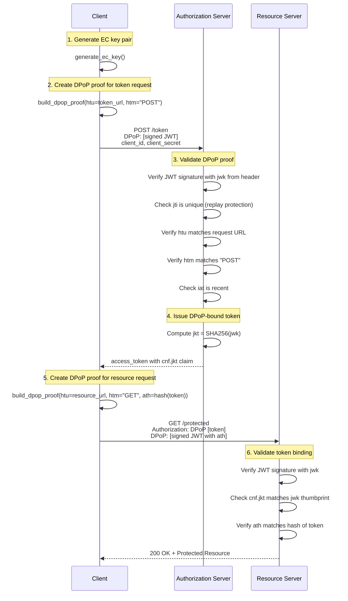
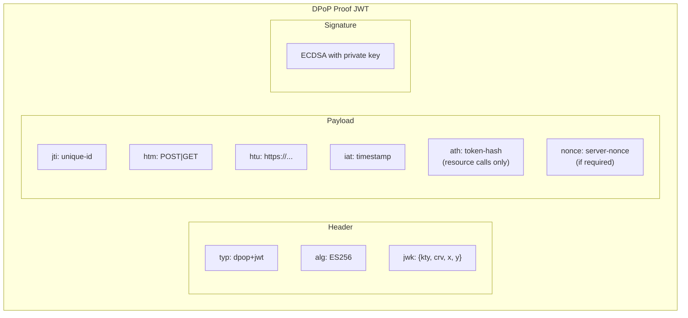
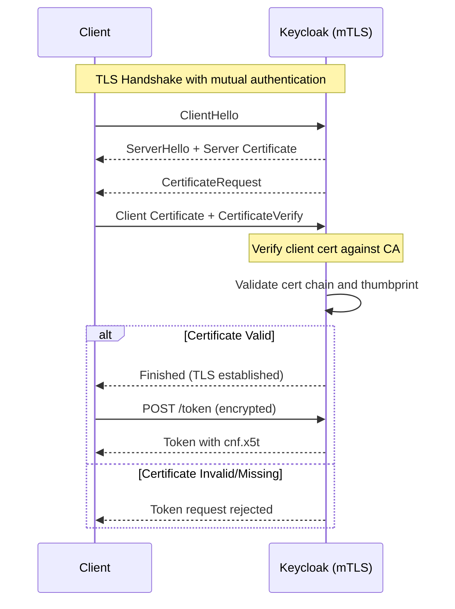
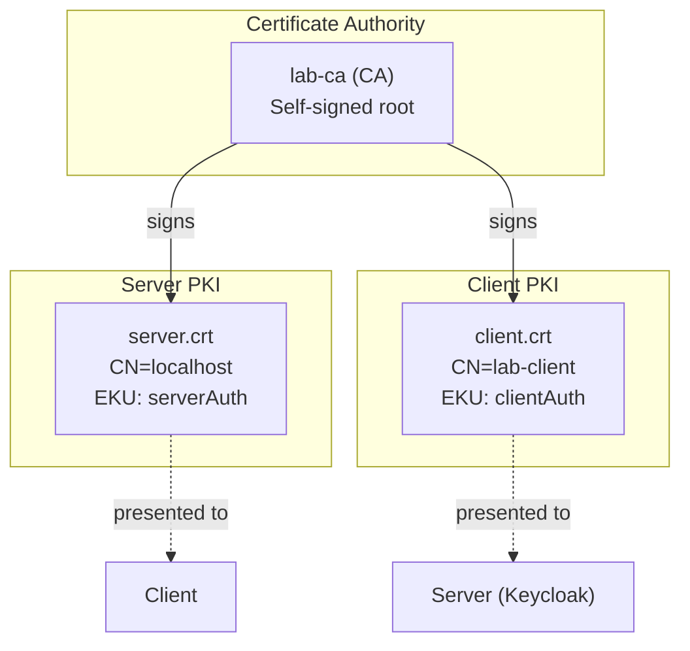
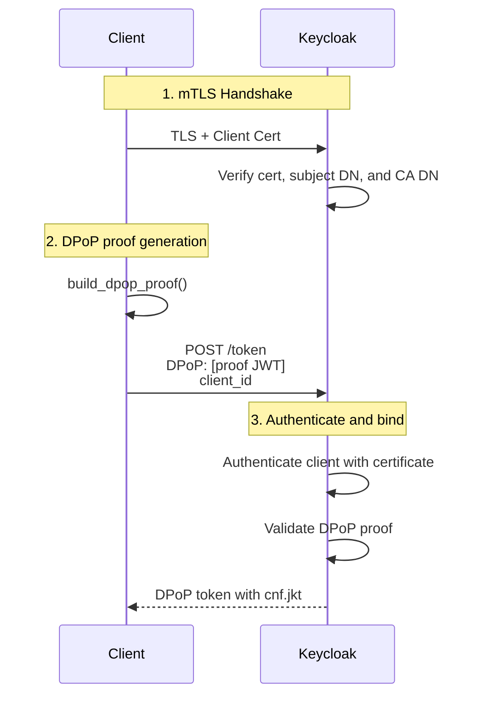

# DPoP & mTLS Flow Diagrams

This document provides visual diagrams explaining how DPoP and mTLS work.

---

## DPoP Token Request Flow

---

## DPoP Proof JWT Structure

---

## mTLS Authentication Flow

---

## PKI Certificate Trust Chain

---

## mTLS Client Authentication + DPoP Token Binding

---

## Security Comparison

| Feature                | Bearer Token | DPoP | mTLS-bound | mTLS auth + DPoP |
| ---------------------- | ------------ | ---- | ---------- | ---------------- |
| Token theft protection | ❌           | ✅   | ✅         | ✅               |
| Per-request proof      | ❌           | ✅   | ❌         | ✅               |
| Channel authentication | ❌           | ❌   | ✅         | ✅               |
| Public client support  | ✅           | ✅   | ⚠️         | ⚠️               |
| No cert infrastructure | ✅           | ✅   | ❌         | ❌               |
| Replay protection      | ❌           | ✅   | ✅         | ✅               |
