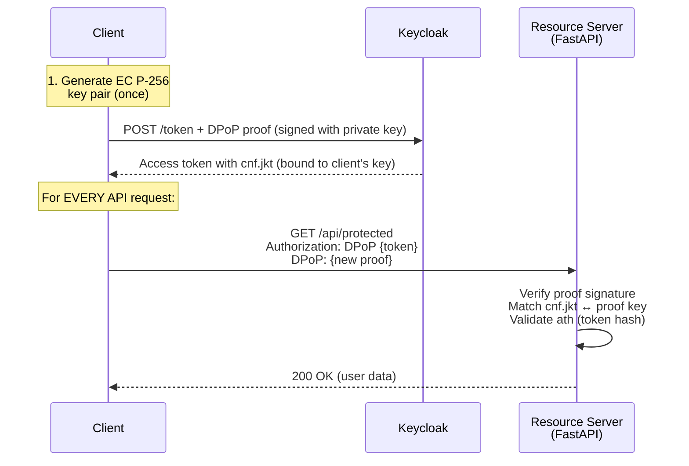
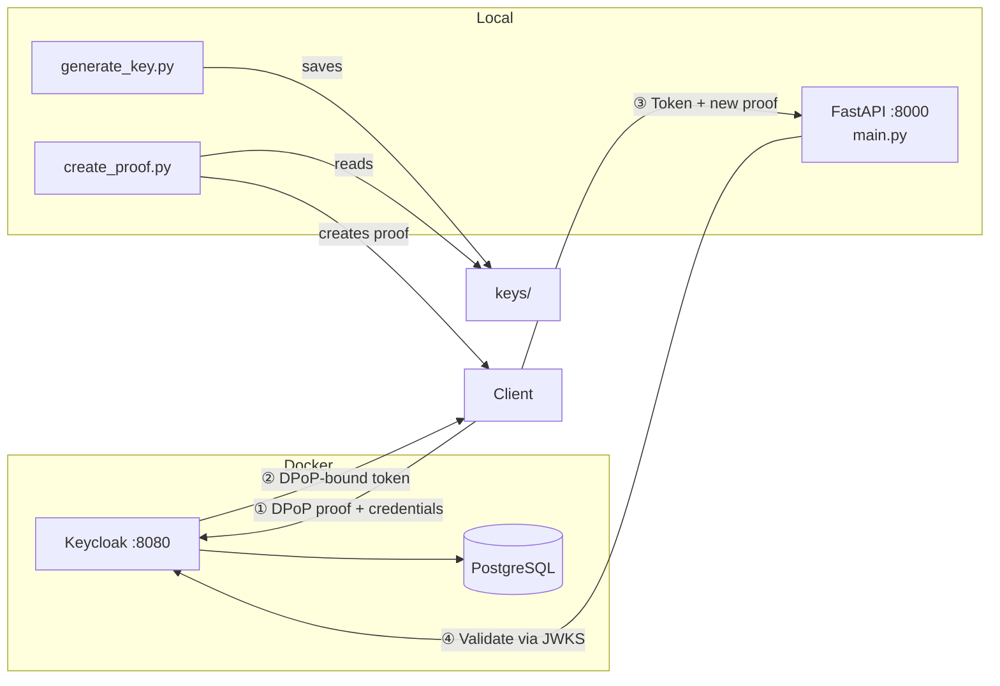
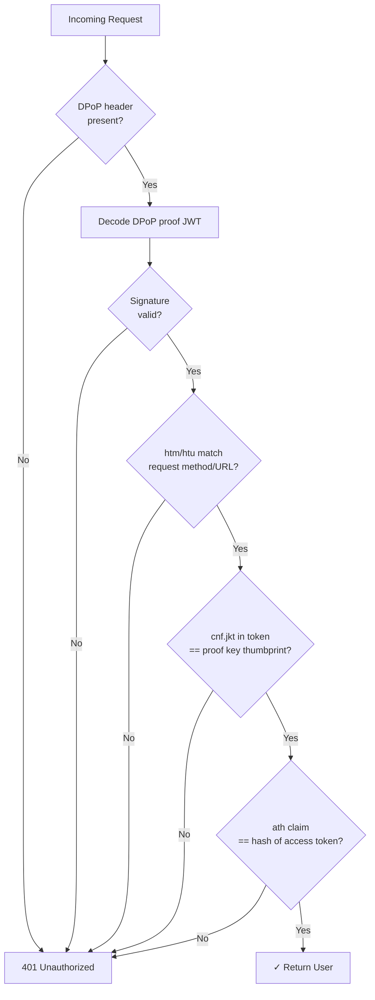

# DPoP with Keycloak

This example demonstrates **DPoP (Demonstrating Proof of Possession)** with Keycloak as the identity provider. DPoP binds access tokens to a specific cryptographic key pair - even if someone steals your token, they can't use it without your private key.

## What is DPoP?

| Attack Vector | Bearer Token | DPoP |
|---------------|--------------|------|
| Token stolen | Attacker can use it | Attacker needs private key too |
| Token replay | Possible | Each proof is request-specific |
| Token forwarding | Easy | Requires key possession |

## How DPoP Works



## Prerequisites

- Docker and Docker Compose
- Python 3.11+
- UV package manager
- **Keycloak 26.4+** (DPoP token binding is supported from this version; see the official Keycloak documentation for configuration details)

## Folder Structure

```
dpop-keycloak/
├── main.py                  # FastAPI resource server (validates DPoP proofs)
├── generate_key.py          # Generates DPoP key pair (run once)
├── create_proof.py          # Creates DPoP proof JWTs (used by curl commands)
├── docker-compose.yml       # Starts Keycloak with DPoP enabled
├── pyproject.toml           # Python dependencies
├── setup.sh / setup.bat    # Installs dependencies
├── .env.example             # Environment template
├── keys/                   # Generated DPoP keys (created by generate_key.py)
│   ├── private_key.pem
│   └── jwk.json
└── realm/                  # Keycloak realm configuration
    └── realm-export.json   # Realm with seeded user (local only, use more secure seeding for prod) and DPoP enabled 
```

### Architecture



### What happens when you run commands

| Command | What it does |
|---------|--------------|
| `./setup.sh` | Installs Python dependencies |
| `docker-compose up -d` | Starts Keycloak in Docker |
| `uv run main.py` | Starts FastAPI server on port 8000 |
| `uv run generate_key.py` | Creates `keys/` directory with your DPoP key pair |
| `uv run create_proof.py ...` | Generates a DPoP proof JWT |

## Quick Start

### 1. Install dependencies

```bash
cd gl-iam-cookbook/gl-iam/examples/dpop-keycloak
./setup.sh  # or: uv sync
```

### 2. Start Keycloak

```bash
docker-compose up -d
```

Wait 30-60 seconds for Keycloak to start, then:

```bash
docker-compose logs -f keycloak
# Look for: "Keycloak ... started"
```

### 3. Run the FastAPI server

```bash
uv run main.py
```

You should see:

```
Connected to Keycloak at http://localhost:8080
DPoP is enabled - tokens will be bound to client keys
INFO: Uvicorn running on http://0.0.0.0:8000
```

### 4. Test with curl

```bash
# Generate your DPoP key pair
uv run generate_key.py

# Get DPoP-bound token
DPOP_PROOF=$(uv run create_proof.py POST "http://localhost:8080/realms/dpop-demo/protocol/openid-connect/token")
TOKEN=$(curl -s -X POST "http://localhost:8080/realms/dpop-demo/protocol/openid-connect/token" \
  -H "Content-Type: application/x-www-form-urlencoded" \
  -H "DPoP: $DPOP_PROOF" \
  -d "client_id=dpop-client" \
  -d "client_secret=dpop-secret" \
  -d "grant_type=password" \
  -d "username=user@example.com" \
  -d "password=user123" | jq -r '.access_token')

# Access protected endpoint (recreate proof if it's already consumed to avoid DPoP replay error)
RESOURCE_PROOF=$(uv run create_proof.py GET "http://localhost:8000/api/protected" "$TOKEN")
curl http://localhost:8000/api/protected \
  -H "Authorization: DPoP $TOKEN" \
  -H "DPoP: $RESOURCE_PROOF"
```

Demo users: `user@example.com` / `user123`

## Understanding the Code

This example has two parts:

### 1. Resource Server (main.py)

The FastAPI server that validates DPoP proofs:

```python
@app.get("/api/protected")
async def protected(user: User = Depends(get_current_user_with_dpop)):
    """This endpoint requires DPoP proof"""
    return {"user": user.email}
```

The `get_current_user_with_dpop` dependency validates incoming requests:



### 2. Client-side (key generation + proof signing)

In this demo, we use Python scripts to simulate the client. **In production, this happens in your actual app:**

- **Web**: Browser's Web Crypto API
- **iOS**: Keychain + Security framework
- **Android**: Android Keystore

## Client-Side: Where Key/Proof Generation Happens

This demo is the **resource server** - it validates DPoP proofs. The actual client-side work (generating keys and signing proofs) happens in your app:

### Web (Browser)

```javascript
// Generate key pair
const keyPair = await crypto.subtle.generateKey(
  { name: "ECDSA", namedCurve: "P-256" },
  true, ["sign", "verify"]
);

// Create DPoP proof (use jose library)
const proof = await createDpopProof(keyPair.privateKey, "POST", tokenUrl);
```

### iOS (Swift)

```swift
// Generate key in Keychain
let privateKey = SecKeyCreateRandomKey(attributes, &error)!
// Sign proof with private key
```

### Android (Kotlin)

```kotlin
// Generate key in Android Keystore
val keyPair = KeyPairGenerator.getInstance("EC", "AndroidKeyStore").apply {
    initialize(KeyGenParameterSpec.Builder("dpop_key", PURPOSE_SIGN).build())
}.generateKeyPair()
```

## Token Storage in Production

**Important**: Where you store the access token matters for security.

| Platform | Recommended Storage | Avoid |
|----------|---------------------|-------|
| Web | httpOnly cookies, IndexedDB | localStorage (XSS vulnerable) |
| iOS | Keychain | UserDefaults |
| Android | EncryptedSharedPreferences | SharedPreferences (unencrypted) |

## Available Endpoints

| Endpoint | Auth | Description |
|----------|------|-------------|
| `/health` | None | Health check |
| `/api/public` | None | Public endpoint |
| `/api/me` | Bearer | User profile (regular token) |
| `/api/protected` | DPoP | DPoP-protected endpoint |

## Cleanup

```bash
docker-compose down -v
```
